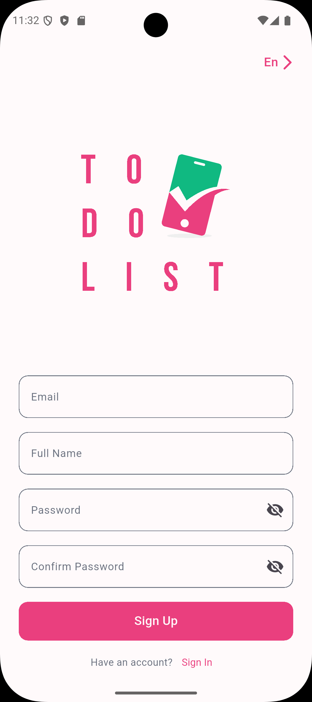
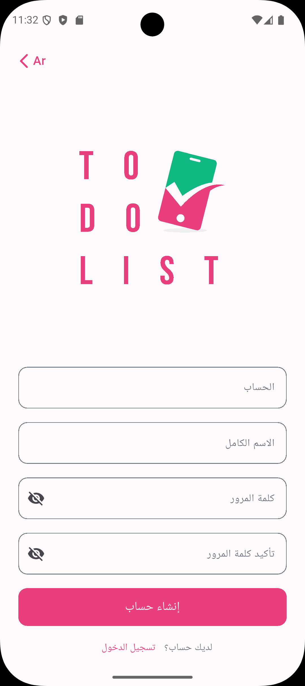
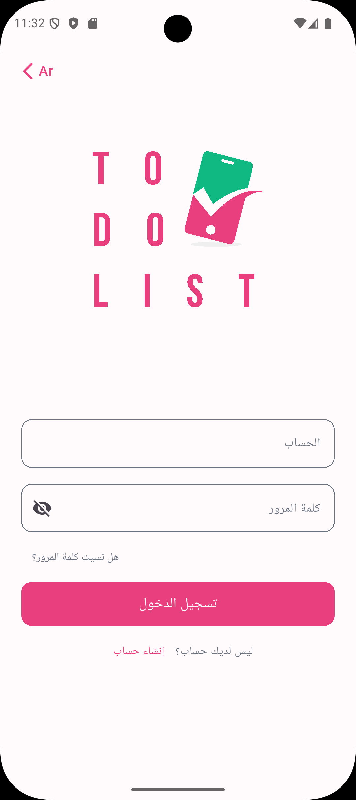
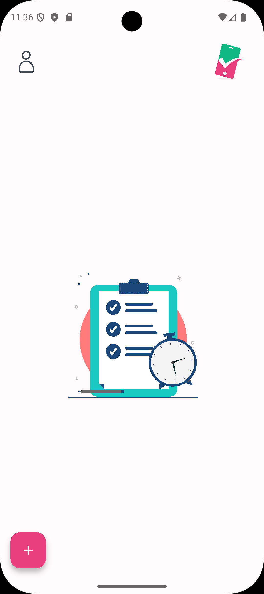
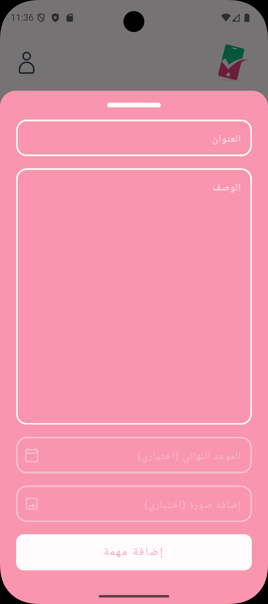
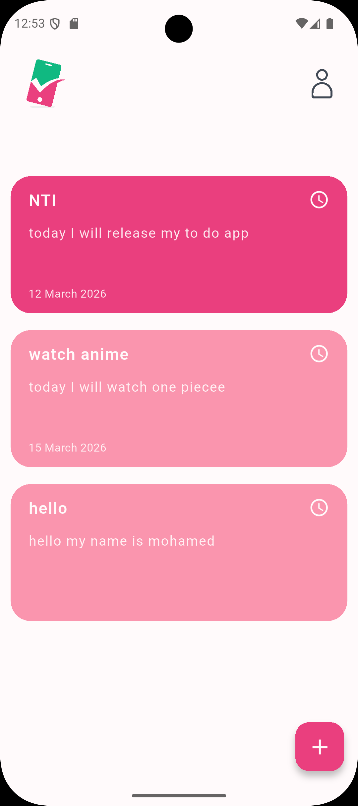
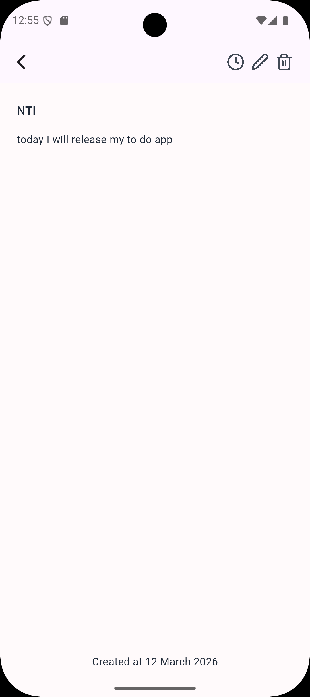
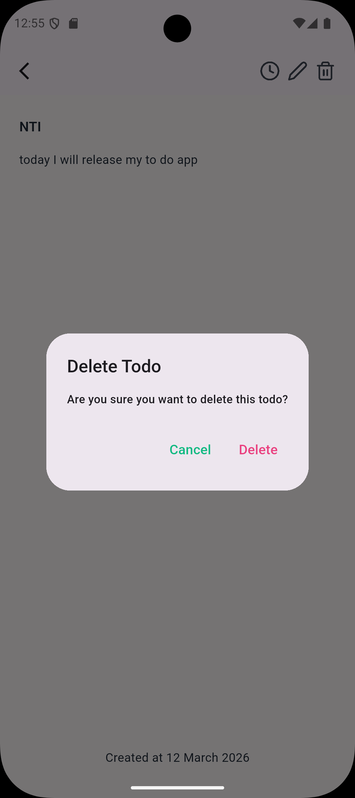
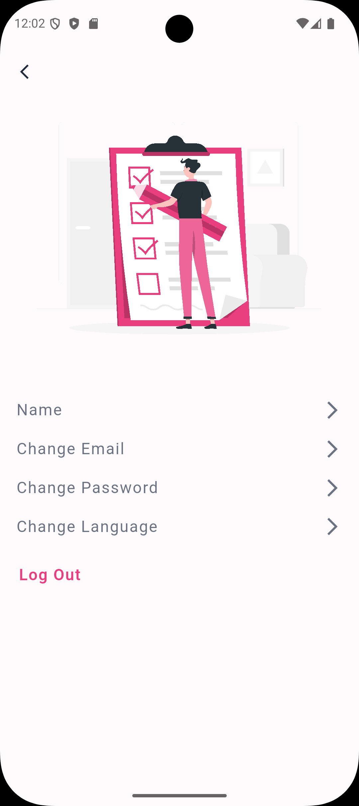

# 📝 Flutter To-Do App


A modern **To-Do Mobile Application** built with **Flutter** following **Clean Architecture principles**.
The app allows users to manage their tasks efficiently with **authentication, cloud storage, and image upload** using **Firebase**.

---

# 🚀 Features

### 🔐 Authentication

* Register new account
* Login with email & password
* Secure logout
* Firebase Authentication integration

### ✅ Task Management

* Add new task
* Edit existing task
* Delete task
* Upload image for task
* Store tasks in **Cloud Firestore**

### ☁️ Firebase Integration

* Firebase Authentication
* Cloud Firestore
* Firebase Storage (for task images)

### 📱 Responsive UI

* Adaptive layouts for different screen sizes
* Clean and modern UI

### 🧠 Clean Architecture

* Scalable project structure
* Separation of concerns
* Easy to maintain and test

---

# 🏗️ Project Architecture

This project follows **Clean Architecture** which separates the application into three main layers:

* **Presentation Layer**
* **Domain Layer**
* **Data Layer**

Each feature is built independently using this architecture.

---

# 📂 Project Structure

```bash
lib
│
├── core
│   ├── responsive
│   └── theme
│
├── features
│   │
│   ├── auth
│   │   ├── data
│   │   │   ├── data_source
│   │   │   └── repository
│   │   ├── domain
│   │   └── presentation
│   │       ├── auth_cubit
│   │       ├── ui_screens
│   │       └── widgets
│   │
│   ├── home
│   │   ├── data
│   │   │   ├── data_source
│   │   │   ├── models
│   │   │   └── repo
│   │   ├── domain
│   │   │   ├── repo
│   │   │   └── use_case
│   │   └── presentation
│   │       ├── home_cubit
│   │       ├── ui_screens
│   │       └── widgets
│   │
│   ├── profile
│   │   ├── data
│   │   │   ├── data_source
│   │   │   ├── models
│   │   │   └── repo
│   │   ├── domain
│   │   │   ├── repo
│   │   │   └── use_case
│   │   └── presentation
│   │       ├── profile_cubit
│   │       ├── ui_screens
│   │       └── widgets
│
├── splash_screen
│   └── splash_screen.dart
│
├── firebase_options.dart
└── main.dart
```

---

# 🔄 Application Flow

1. User opens the application
2. Splash screen checks authentication state
3. If user is not authenticated → Navigate to **Login / Register**
4. If authenticated → Navigate to **Home Screen**

Inside the app the user can:

* Create tasks
* Update tasks
* Delete tasks
* Upload images
* Manage profile
* Logout

---

# 📸 Screenshots

<div align="center">

### Authentication





### Home






### Task Management





### Profile



</div>

---

# 🛠️ Tech Stack

* **Flutter**
* **Dart**
* **Firebase Authentication**
* **Cloud Firestore**
* **Firebase Storage**
* **Cubit (Bloc)**
* **Clean Architecture**
* **Responsive UI**

---

# ⚙️ Installation

Clone the repository:

```bash
git clone https://github.com/MohamedMahmoudLashin/to_do_app.git
```

Navigate to project folder:

```bash
cd to_do_app
```

Install dependencies:

```bash
flutter pub get
```

Run the app:

```bash
flutter run
```

---

# 👨‍💻 Author

**Mohamed Mahmoud Lashin**

GitHub:
https://github.com/MohamedMahmoudLashin

---

⭐ If you like this project, consider giving it a star on GitHub!
